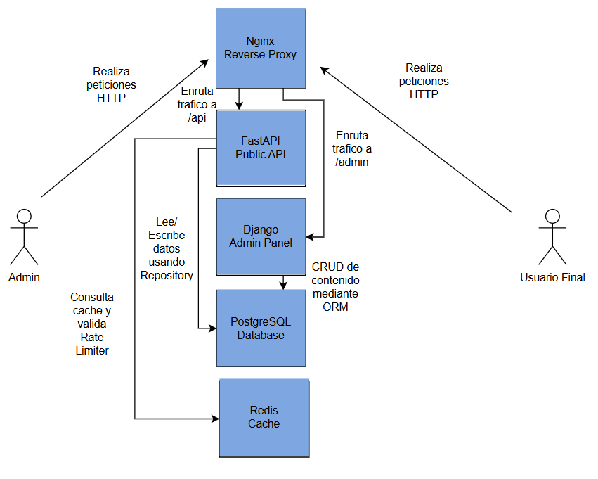
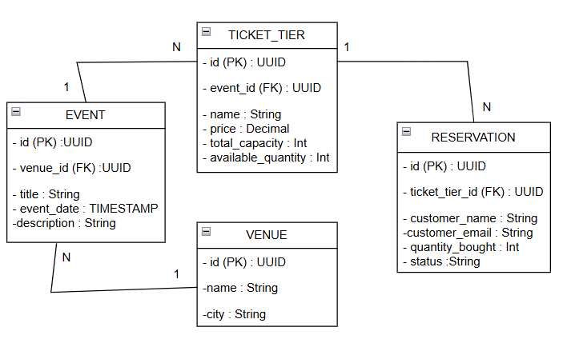

# LOUD // Backend para Venta de Entradas

¡Hola! Este repositorio contiene el backend para la plataforma de eventos "LOUD". El objetivo de este proyecto fue crear un sistema rápido, ordenado y preparado para el mundo real, usando buenas prácticas de programación, caché para que cargue súper rápido y protección contra bots.

## 🚀 Cómo funciona nuestra Infraestructura (Docker Compose)

Todo el proyecto se levanta con un solo comando gracias a Docker. Usamos 5 piezas clave que trabajan en equipo:

1. **Nginx:** Es nuestro proxy inverso. Recibe todas las peticiones y decide a dónde enviarlas. Además, sirve los archivos estáticos directamente para mayor rendimiento.
2. **PostgreSQL:** Nuestra base de datos principal aislada en el esquema `content`.
3. **Redis:** Memoria de ultra alta velocidad usada para bloquear bots y guardar datos temporalmente (caché).
4. **Django (Admin):** Backoffice servido en producción mediante **Gunicorn (WSGI)**. Lo usamos exclusivamente como panel de administración visual.
5. **FastAPI:** El corazón del proyecto servido con **Uvicorn**. Una API asíncrona que se comunica con el frontend para mostrar los eventos.

## 📊 Modelo de Datos (Opción A)

Elegimos trabajar con el dominio de **Venta de Entradas para Conciertos y Eventos**. 

## 🏛 Arquitectura C4



### ¿Cómo organizamos la base de datos?

* **Lugares y Eventos separados:** El lugar del evento (`Venue`) está separado del evento en sí (`Event`). Así no repetimos la misma dirección cien veces.
* **Entradas inteligentes:** Creamos un modelo `TicketTier` que controla la capacidad total y el inventario disponible en tiempo real.
* **UUIDs:** Todas las claves primarias utilizan códigos únicos universales (UUID) por seguridad.

## 🗄 Modelo de Base de Datos (Diagrama ER)



## 🛠 Buenas Prácticas y Código Limpio (SOLID)

* **SRP:** Las rutas solo reciben peticiones, los servicios manejan la lógica.
* **Patrón Repositorio:** Sacamos todas las consultas SQL y las aislamos en clases concretas (`PostgresEventRepository`).
* **Inyección de Dependencias:** Usamos `Depends` en FastAPI para inyectar repositorios y cachés mediante protocolos (DIP).
* **Pydantic:** Usamos esquemas estrictos para el contrato de salida JSON.

## 💾 Seed de Datos Automático

Para pruebas de estrés, preparamos un script (`seed_data.py`) que usa `bulk_create`.
* Genera **300 eventos** y **150,000 reservas** en segundos.
* **Se ejecuta automáticamente** en el primer arranque del contenedor gracias al script del Dockerfile, por lo que el evaluador no necesita hacer nada manual.

## 🛡 Lógica de Negocio y Seguridad

### Evitando sobreventas (Race Conditions)
En un sistema de tickets, dos personas pueden intentar comprar el último asiento al mismo tiempo. **¿Cómo lo manejamos?** Lo resolvimos a nivel de base de datos aplicando un `CHECK constraint` en el DDL (`CHECK (available_quantity >= 0)`). Si una transacción intenta bajar el inventario a números negativos, PostgreSQL aborta la operación de forma segura.

### Caché y Degradación Grácil (Graceful Degradation)
Guardamos las respuestas de la API en Redis por 30 segundos. Si Redis se llega a caer, la API **no se rompe**; el bloque `try/except` atrapa el error y la API va a buscar los datos directamente a PostgreSQL para mantenerse viva.

### Bloqueo de Bots (Rate Limiting)
Se implementó un middleware inyectable conectado a Redis. Si alguien hace más de 20 peticiones por minuto, le bloqueamos el acceso devolviendo un `429 Too Many Requests`.

## 🌍 Zonas Horarias y Hardening

* **Fechas:** Guardamos todas las fechas en UTC y usamos `make_aware` de Django para mantener la consistencia (*timezone-aware*).
* **Nginx:** Ocultamos la versión del servidor (`server_tokens off;`) para evitar escaneos de vulnerabilidades.

## 🧪 Pruebas Automatizadas

Para garantizar la estabilidad del sistema y cumplir con los estándares de calidad, se implementaron dos suites de pruebas automatizadas (una por cada servicio) alcanzando un total de 10 pruebas exitosas.

**Pruebas de la API Pública (FastAPI - `pytest`):**
* **`test_healthz_endpoint`:** Valida la disponibilidad del servicio y comprueba que la conexión con PostgreSQL esté activa.
* **`test_list_events_pagination`:** Asegura que los parámetros de paginación devuelvan la estructura de datos JSON exacta exigida por el contrato del frontend.
* **`test_event_not_found`:** Verifica el manejo seguro de errores devolviendo un HTTP 404 ante identificadores UUID inexistentes.
* **`test_rate_limiter_blocks_bots`:** Simula ráfagas rápidas de tráfico para corroborar la activación del bloqueo HTTP 429 (Too Many Requests) por parte de Redis.
* **`test_search_endpoint`:** Confirma que el motor de búsqueda por texto (`?query=`) filtre de forma precisa los eventos en la base de datos.

**Pruebas del Backoffice (Django - `TestCase`):**
* **`test_healthz_endpoint`:** Verifica que el servidor WSGI responda correctamente a las solicitudes de monitoreo de estado.
* **`test_venue_creation`:** Prueba a nivel de ORM que la inserción de datos relacionales funcione y los modelos apliquen sus representaciones de texto correctamente.
* **`test_admin_login_page_loads`:** Comprueba que la interfaz gráfica de seguridad y login del panel se rendericen con un HTTP 200 sin errores internos.
* **`test_database_is_reachable`:** Verifica activamente que el entorno de testing pueda realizar operaciones de lectura/escritura en PostgreSQL.
* **`test_models_exist`:** Prueba de sanidad estructural que valida la importación y vinculación sin errores de todos los modelos del dominio (`Event`, `TicketTier`, `Reservation`).
---

## 🚀 Cómo ejecutar el proyecto

**1. Configurar variables de entorno:**
```bash
cp .env.example .env

```

*(El archivo de ejemplo ya contiene las credenciales necesarias para levantar todo).*

**2. Levantar los contenedores:**

```bash
docker-compose up -d --build

```

*(El sistema migrará, creará el superusuario y poblará la base de datos automáticamente. ¡Dale unos 20-30 segundos para que termine!)*

**3. Enlaces de acceso rápido:**

* 🎟️ **Frontend:** [http://localhost/](https://www.google.com/search?q=http://localhost/)
* ⚙️ **Panel Admin:** [http://localhost/admin/](https://www.google.com/search?q=http://localhost/admin/) *(User: `admin` | Pass: `admin123`)*
* 📡 **API (Búsqueda):** [http://localhost/api/v1/events/search/?query=NASA](https://www.google.com/search?q=http://localhost/api/v1/events/search/%3Fquery%3DNASA)
* 📖 **Docs API:** [http://localhost/api/openapi.json](https://www.google.com/search?q=http://localhost/api/openapi.json)

**4. Ejecutar pruebas automatizadas:**

```bash
docker exec -it fastapi_backend pytest tests/ && docker exec -it django_admin python manage.py test

```

**5. Detener el proyecto:**

```bash
docker-compose down -v

```

---

## 📝 Retrospectiva y Decisiones de Diseño

**Mis Trade-offs (Compromisos de Diseño):**
Decidí usar un script de carga masiva (`bulk_create`) en Django en lugar de insertar uno por uno para que el despliegue fuera rápido. El *trade-off* es que este método salta el método `.save()` de los modelos de Django, por lo que no se ejecutarían "señales" (signals) si existieran, pero ganamos una velocidad de inicialización brutal.

**De lo que me siento más orgullosa:**
Me enorgullece muchísimo haber logrado que el panel de administración funcione correctamente y esté integrado en la misma red de contenedores con FastAPI y Nginx. Anteriormente pasé semanas intentando hacer tareas similares de despliegue sin éxito, así que ver que esta vez logré sacarlo adelante y hacerlo funcionar con Gunicorn es un gran logro personal.

**Lo que menos me gustó y haría diferente con más tiempo:**
La paginación actual de la API en el servicio toma los resultados y hace el rebanado (slicing) en memoria. Aunque funciona perfecto para 300 eventos, si tuviéramos 5 millones de eventos, consumiría demasiada RAM. Si tuviera más tiempo, implementaría la paginación a nivel de SQL directo en el Repositorio usando `LIMIT` y `OFFSET`. Además, la frustración por los errores constantes me demostró que cambiar una cosa pequeña (como un archivo wsgi) puede romper todo el flujo si no se tiene cuidado.
